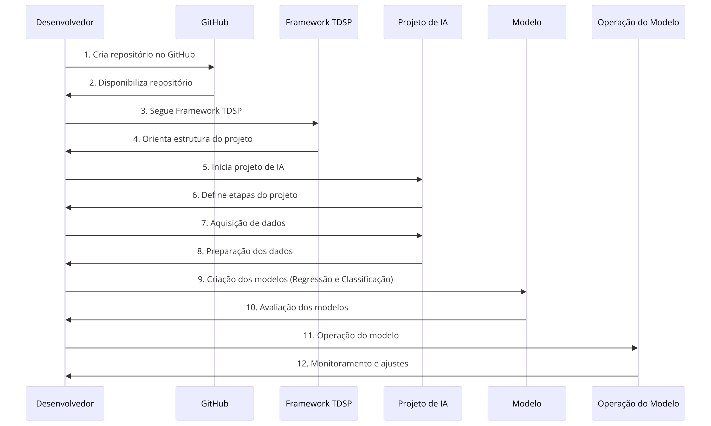

# 2. Iremos desenvolver um preditor de arremessos usando duas abordagens (regressão e classificação) para prever se o "Black Mamba" (apelido de Kobe) acertou ou errou a cesta. Para começar o desenvolvimento, desenhe um diagrama que demonstra todas as etapas necessárias em um projeto de inteligência artificial desde a aquisição de dados, passando pela criação dos modelos, indo até a operação do modelo.'
---
## Diagrama do Fluxo de Desenvolvimento de Machine Learning

Este documento descreve as etapas ilustradas no diagrama de fluxo do meu projeto de machine learning para prever os resultados dos arremessos do Kobe Bryant. O diagrama foi desenhado para mapear visualmente cada fase do projeto, desde a inicialização até a operação do modelo.

## Descrição das Etapas

1. **Criação do Repositório no GitHub**: Iniciei o projeto criando um repositório no GitHub, o que estabelece a base para o controle de versão e colaboração.

2. **Disponibilização do Repositório**: Tornei o repositório público, permitindo que outros colaboradores e partes interessadas acessassem e contribuíssem para o projeto.

3. **Adesão ao Framework TDSP**: Implementei o projeto seguindo o Team Data Science Process, uma metodologia estruturada fornecida pela Microsoft para desenvolvimento de projetos de ciência de dados.

4. **Estruturação do Projeto**: Organizei o projeto em diretórios e arquivos conforme as convenções do TDSP, garantindo clareza e uma gestão eficiente dos artefatos do projeto.

5. **Início do Projeto de IA**: Com o repositório e a estrutura prontos, dei início ao desenvolvimento efetivo do projeto de inteligência artificial.

6. **Definição das Etapas do Projeto**: Esquematizei todas as etapas do projeto, planejando cada fase desde a aquisição de dados até a operação do modelo em produção.

7. **Aquisição de Dados**: Baixei os dados dos arremessos de Kobe Bryant para análise, conforme sugerido no PDF do projeto.

8. **Preparação dos Dados**: Realizei o pré-processamento dos dados para limpeza, filtragem e preparação para os algoritmos de machine learning.

9. **Criação dos Modelos (Regressão e Classificação)**: Desenvolvi modelos usando técnicas de regressão e classificação para prever os resultados dos arremessos.

10. **Avaliação dos Modelos**: Após o treinamento, avaliei os modelos com base em métricas apropriadas para determinar sua performance e eficácia.

11. **Operação do Modelo**: Com um modelo selecionado, passei para a fase de operação, onde o modelo está pronto para ser utilizado em um ambiente produtivo.

12. **Monitoramento e Ajustes**: Na última fase, assegurei o monitoramento contínuo do modelo e realizei ajustes conforme necessário para manter sua acurácia e confiabilidade.

## Conclusão

O diagrama e as etapas documentadas aqui representam o ciclo de vida completo do projeto de machine learning, destacando a importância de cada fase no desenvolvimento de um sistema de IA eficiente e robusto.